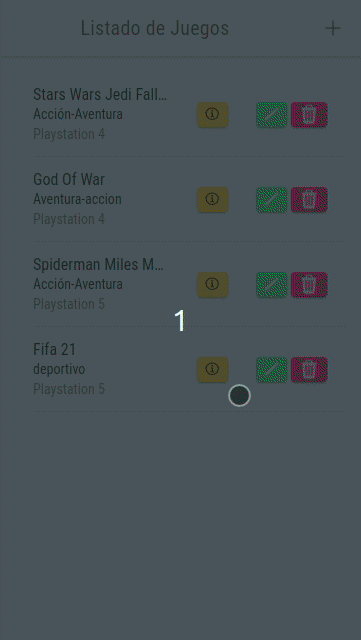

Proyecto para asignatura de Acceso a Datos de CFGS Desarrollo aplicaciones Multiplataforma (2ºDAM).

# iList-Game

Aplicación para guardar lista de videojuegos a los que has jugado. V.1.0

## Sobre la aplicación

Aplicación realizada en Ionic.
- Permite agregar a la lista un videojuego.
- Permite añadir título, plataforma, género, y fecha de inicio del videojuego.
- Póngale nota al videojuego.
- Marca si has completado el videojuego.

## ¿Como usar la App?

### Agregar juego a lista

### Editar juego de la lista

### Ver información de juego

### Eliminar juego de la lista

